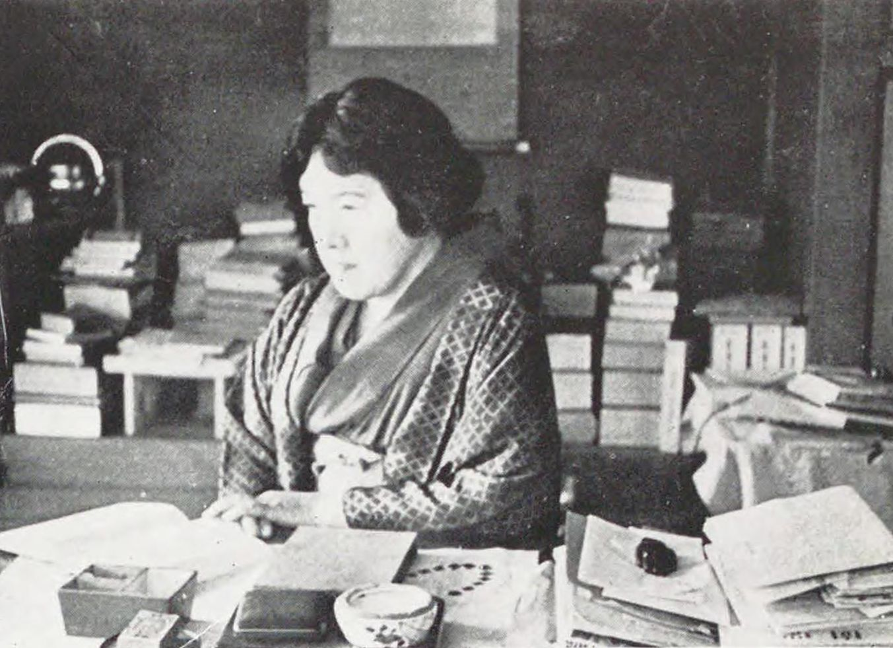
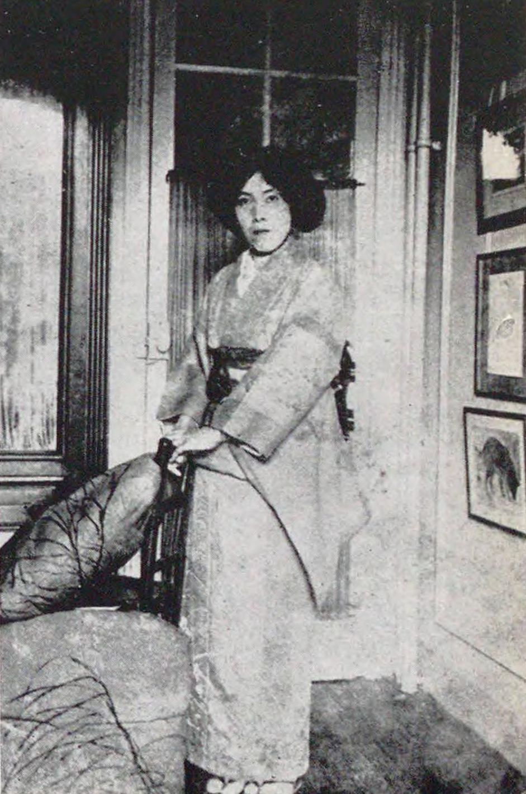

# Yosano Akiko - Poet, Author, & Social Reformer

Yosano Akiko, born near Ōsaka, Japan was a prolific writer known for her sexual and provocative tanka poems. Akiko’s most notable work, <em>Midaregami (Tangled Hair)</em>, is often credited as one of the most influential publications in Japanese twentieth-century literature. Despite its popularity in Japanese literature studies, the <em>Midaregami</em> only represents a small portion of her work. Over the course of her life, Akiko wrote over 50,000 poems (publishing twenty-one poetry collections), produced two translations of <em>The Tale of Genji</em> into modern Japanese, and drafted a variety of essays and social and political criticism.

---

    

    <l>Yosano Akiko. National Diet Library, Japan</b></l>

---

## Why the _Midaregami_?

Although Akiko would eventually express her discontent with <em>Midaregami</em>, this 1901 publication revitalized tanka poetry (characterized by a 5-7-5-7-7 syllabic structure) and its “rich and suggestive imagery” that sparked significant discourse within the literary community (FIREBIRD 6). According to (JONES), one critic of her <em>Midaregami</em> went so far as to claim that these Akiko’s tankas were “immoral words that belong in the mouths of whores and streetwalkers” (376). By our modern standards, Akiko’s gendered, sexual word choice is hardly provocative, but this collection of tankas challenged the norms of Japanese literature and women writers’ contributions to the field.

A handful of translations of Akiko’s <em>Midaregami</em> exist already, but the edition selected for this project (trans. Jane Reichhold and Machiko Kobayashi, 2013) is the first English translation of <em>all</em> 399 tankas included in the original publication. This version, entitled <em>A Girl with Tangled Hair</em>, offers romantic, digestible interpretations of the Japanese tankas, differing significantly from the translations that came before it.

---

    <b><em>“My poems are my diary”</em> - Yosano Akiko to her eldest son. (FIREBIRD 2).</b>

---

    <l><b>Project Objectives</b></l>

This TEI project, powered by GitHub and EditionCrafter, attempts to preserve Yosano's legacy by digitizing all 399 of her <em>Midaregami</em> tankas while also exploring the complexity of translation studies as a field; alongside the Reichhold/Kobayashi collection, this project incorporates ten translations from Dennis Maloney's and Hide Oshiro's <em>Tangled Hair: Selected Tanka of Yosano Akiko</em> (2012), as well as ten from Sam Hamill's and Keiko Matsui Gibson's <em>River of Stars: Selected Poems of Yosano Akiko</em> (1996). Under the “Editions” tab, this webpage offers the Japanese kana (labeled as “Facsimile”), Romaji transliteration, and Reichhold and Kobayashi translation of Akiko’s 399 tankas published in her <em>Midaregami</em>. 

In addition to the digitization goal, this  aims to shed light on translation differences between Reichhold and Kobayashi’s text with two the aforementioned other translations for use in writing instruction. With the rise of AI/Large Language Models, students increasingly turn to automated translation services, prioritizing efficiency over stylistic, individual decisions; therefore, the “Translations” tab of 10 of the 399 tankas present all three translations back-to-back, as well as translations provided by ChatGPT and Google Translate. These tankas have an additional tab for a closer analysis of the differences between each translation.

    

    <l>Yosano Akiko. National Diet Library, Japan</b></l>

